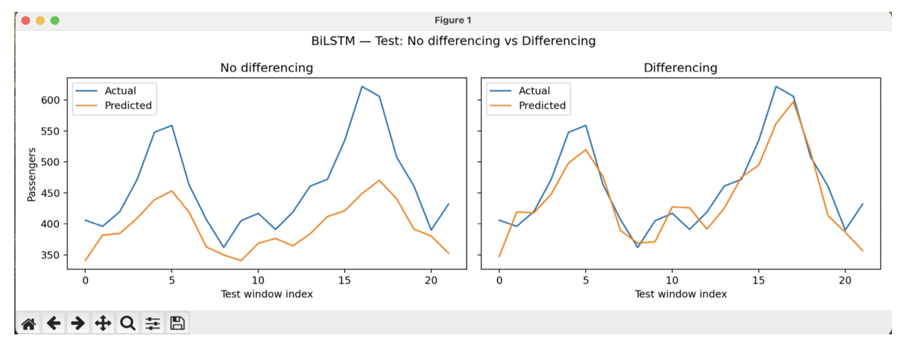

# Time Series Forecasting with Recurrent Neural Networks

This project explores time series forecasting using recurrent neural network architectures.

Three models are implemented and compared:

- Long Short-Term Memory (LSTM)
- Gated Recurrent Unit (GRU)
- Bidirectional LSTM

The models are trained on the Airline Passengers dataset to learn temporal patterns such as trend and seasonality.

---

## Dataset

Airline Passengers Dataset

- Monthly international airline passenger totals
- Time period: 1949 – 1960
- Total observations: 144

This dataset is commonly used as a benchmark for time series forecasting.

Dataset source:
https://www.kaggle.com/datasets/rakannimer/air-passengers

---

## Methodology

A sliding window approach is used to construct input-output pairs.

- Window length: 24 past observations
- Forecast horizon: 1 step ahead

Each model predicts the next value of the time series.

---

## Models

Three recurrent neural network architectures were evaluated:

- LSTM
- GRU
- Bidirectional LSTM

All models were trained using the same configuration to ensure a fair comparison.

Training setup:

- Hidden size: 64
- Optimizer: Adam
- Learning rate: 1e-3
- Batch size: 16
- Maximum epochs: 300
- Early stopping based on validation loss

---

## Experiment

Two forecasting approaches were compared:

### Direct Forecasting
The model predicts the next value of the time series.

### Differencing
The model predicts the change between consecutive observations, which is then used to reconstruct the forecast.

This experiment shows how **data representation affects forecasting accuracy**.

---

## Results

The models were evaluated using:

- Mean Absolute Error (MAE)
- Root Mean Squared Error (RMSE)

The Bidirectional LSTM achieved the best performance among the evaluated architectures, and differencing significantly improved forecasting accuracy.

---

## Forecasting Results

---

## Author

Keerthija Bontu  
M.Eng. Information Technology (Specialization: Artificial Intelligence)
