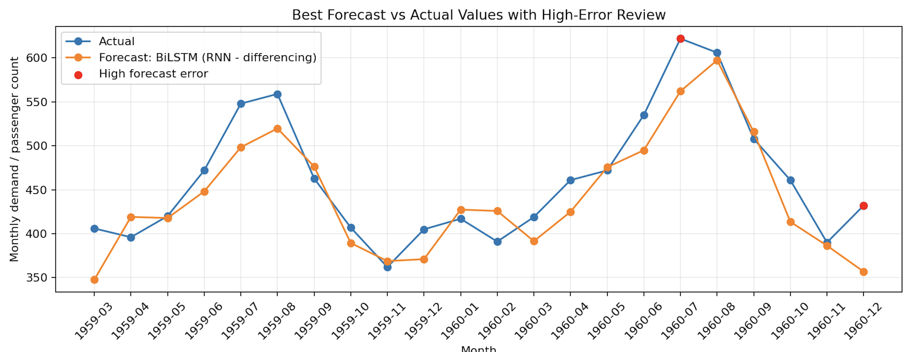
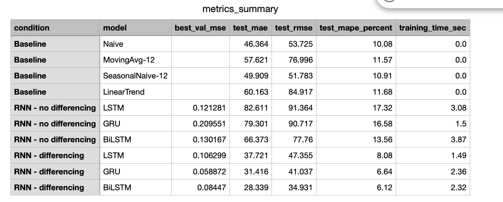
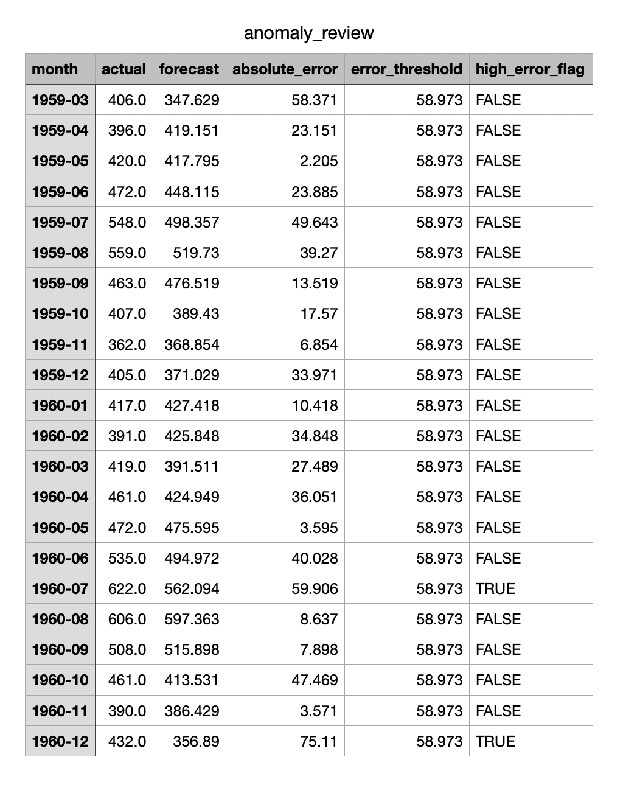
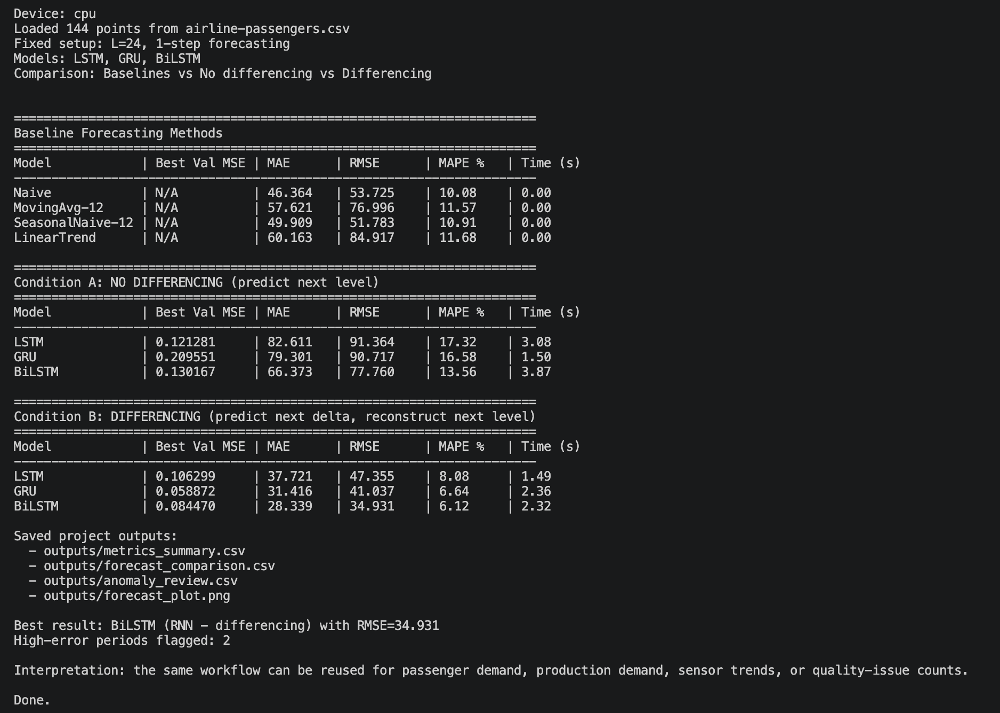

# Time Series Forecasting & Error Monitoring Pipeline

I first built this project as a time-series forecasting experiment for comparing recurrent neural network models. The original idea was to use past observations to predict the next value in the series and understand how LSTM, GRU, and Bidirectional LSTM behave on sequential data.

After that, I extended it into a more practical forecasting pipeline. I added baseline models, error metrics, saved output reports, and a high-error review file so the project is not only about training models, but also about checking whether the forecast is useful for monitoring or planning.

The dataset used here is the Airline Passengers dataset. Even though it is a public benchmark dataset, I treated it like a monthly demand signal. The same workflow could be reused for production demand, sensor trends, quality issue counts, or other industrial time-series data.

## What This Project Does

- Loads a monthly time-series dataset from CSV.
- Creates sliding-window samples using the past 24 observations.
- Compares simple forecasting baselines with deep learning models.
- Trains and evaluates LSTM, GRU, and Bidirectional LSTM models.
- Tests forecasting with and without differencing.
- Uses MAE, RMSE, and MAPE for evaluation.
- Saves clean output files for review and reporting.
- Flags high forecast-error periods for further analysis.

## Why I Added Baselines

I did not want the project to only show deep learning models. In real forecasting work, a deep learning model should be compared against simple methods first. That is why I added:

- Naive previous-value forecast
- Moving average forecast
- Seasonal naive forecast
- Linear trend forecast

This made the experiment more realistic because the RNN models had to prove that they were better than basic forecasting rules.

## Models Compared

- Naive baseline
- Moving average baseline
- Seasonal naive baseline
- Linear trend baseline
- LSTM
- GRU
- Bidirectional LSTM

For the RNN models, I compared two settings:

- **No differencing:** predict the next value directly.
- **Differencing:** predict the next change and reconstruct the next value.

## Results Summary

The best result came from the **Bidirectional LSTM with differencing**.

In my final run, the model achieved:

- MAE: 28.339
- RMSE: 34.931
- MAPE: 6.12%

The experiment also showed that differencing improved the RNN models clearly. Without differencing, the RNN models struggled more with the trend and seasonal pattern.

## Forecast Output



## Metrics Summary



## High-Error Review



## Terminal Run



## Saved Outputs

Each run saves the same output files into the `outputs/` folder, so the project stays clean and does not create random extra files.

```text
outputs/
  metrics_summary.csv
  forecast_comparison.csv
  anomaly_review.csv
  forecast_plot.png
```

The output files help show:

- model comparison results
- actual vs predicted values
- forecast errors
- high-error periods that need review

## How To Run

```bash
python3 time_series_rnn_forecasting.py
```

The script prints the model comparison tables in the terminal and saves the final output files in `outputs/`.

## Main Things I Learned

- Time-series models should be compared with simple baselines.
- Differencing can improve forecasting when the data has trend or seasonality.
- MAE and RMSE are useful, but MAPE makes the error easier to understand in percentage terms.
- A forecast is more useful when the error is monitored, not only when one final score is reported.
- Saving outputs makes the experiment easier to review and reproduce.

## Current Limitations

- The dataset is small, with 144 monthly observations.
- The project uses one-step-ahead forecasting.
- It does not yet include external features such as holidays, events, or economic indicators.
- The high-error review is based on forecast error thresholds, not a separate anomaly detection model.

## Future Improvements

- Test the same pipeline on industrial sensor or demand data.
- Add multi-step forecasting.
- Add external features for better demand prediction.
- Compare with statistical models such as ARIMA or Exponential Smoothing.
- Add a separate anomaly detection method for forecast residuals.

## Resume Summary

Built a time-series forecasting and error-monitoring pipeline using Python and PyTorch, comparing baseline forecasting methods with LSTM, GRU, and Bidirectional LSTM models. Evaluated direct forecasting vs differencing using MAE, RMSE, and MAPE, and generated saved reports for forecast comparison, model metrics, and high-error review.
