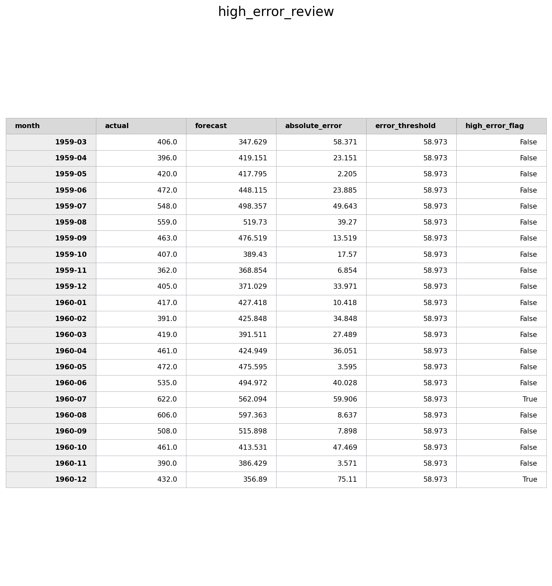

# Time Series Forecasting with Error Review

I first built this project as a time-series forecasting experiment for comparing recurrent neural network models. The original idea was to use past observations to predict the next value in the series and understand how LSTM, GRU, and Bidirectional LSTM behave on sequential data.

After that, I extended it into a more practical forecasting workflow. I added baseline models, error metrics, saved output reports, and a high-error review file so the project is not only about training models, but also about checking whether the forecast is useful for monitoring or planning.

The dataset used here is the Airline Passengers dataset. Even though it is a small public example dataset, I treated it like a monthly demand signal. The same workflow could be reused for passenger demand, inventory demand, sensor trends, quality issue counts, or other monthly time-series data.

I also added an optional PySpark preprocessing step. The dataset itself is small, so Spark is not technically needed for this file. I added it because I wanted to practise the kind of raw-to-clean data preparation that would be needed if the same forecasting workflow was used on larger demand, machine, or sensor datasets.

The main idea is simple: a forecast should not stop at one final metric. It should also show where the model was wrong, which periods need review, and whether the model is actually better than simple baselines.

## What This Project Does

- Loads a monthly time-series dataset from CSV.
- Creates sliding-window samples using the past 24 observations.
- Compares simple forecasting baselines with deep learning models.
- Trains and evaluates LSTM, GRU, and Bidirectional LSTM models.
- Tests forecasting with and without differencing.
- Uses MAE, RMSE, and MAPE for evaluation.
- Saves clean output files for review and reporting.
- Flags high forecast-error periods for further analysis.
- Produces a small monitoring-style report that can be checked after each run.
- Saves a run summary with dataset size, split sizes, best model, next-best comparison, and review threshold.
- Saves a data-quality report so the experiment is not dependent on hidden assumptions.
- Includes an optional PySpark preprocessing script for schema checks, duplicate checks, lag features, rolling features, target creation, and chronological split labeling.

## Why I Added Baselines

I did not want the project to only show deep learning models. In real forecasting work, a deep learning model should be compared against simple methods first. That is why I added:

- Naive previous-value forecast
- Moving average forecast
- Seasonal naive forecast
- Linear trend forecast

This made the experiment more realistic because the RNN models had to prove that they were better than basic forecasting rules.

## Models Compared

- Naive baseline
- Moving average baseline
- Seasonal naive baseline
- Linear trend baseline
- LSTM
- GRU
- Bidirectional LSTM

For the RNN models, I compared two settings:

- **No differencing:** predict the next value directly.
- **Differencing:** predict the next change and reconstruct the next value.

## Results Summary

The best result came from the **Bidirectional LSTM with differencing**.

In my final run, the model achieved:

- MAE: 28.339
- RMSE: 34.931
- MAPE: 6.12%

The same run compared 10 forecasting configurations in total: 4 baselines, 3 RNN models without differencing, and 3 RNN models with differencing. The next-best model was GRU with differencing, with RMSE 41.037. The BiLSTM with differencing improved RMSE by 6.106, which is about 14.88% better than the next-best result in this run.

The experiment also showed that differencing improved the RNN models clearly. Without differencing, the RNN models struggled more with the trend and seasonal pattern.

In this final run, the high-error review flagged 2 months where the forecast error crossed the review threshold. I added this because in practical forecasting, the question is not only "which model is best?", but also "where should a person look more carefully?"

## Data and Split Check

The script also saves a small data-quality report before interpreting the model outputs. In the current dataset:

- Total observations: 144 monthly values
- Time range: 1949-01 to 1960-12
- Missing values: 0
- Duplicate months: 0
- Train / validation / test points: 100 / 22 / 22
- Sliding-window length: 24 months

## Optional PySpark Preprocessing

The main forecasting script can run directly from `airline-passengers.csv`. I kept it that way because the dataset is small and easy to inspect.

The optional Spark script is a separate preprocessing stage:

```text
raw monthly CSV
      |
Spark schema and quality checks
      |
lag and rolling-window feature creation
      |
chronological split labeling
      |
processed feature file + preprocessing report
      |
PyTorch forecasting script
```

This is the part I added to practise a more realistic data-engineering workflow. In a real demand or sensor forecasting problem, the raw data may contain missing dates, duplicates, invalid values, or many machine/product groups. Spark is useful there because the data preparation step can be separated from the model-training step.

Install the optional Spark dependency:

```bash
pip install -r requirements-spark.txt
```

Run the Spark preprocessing step:

```bash
python3 spark_preprocess_timeseries.py
```

It creates:

```text
data/processed/monthly_demand_features.csv
outputs/spark_preprocessing_report.json
```

The generated feature file includes previous-month lags, seasonal lag, rolling means, next-month target, and split labels. I kept this as a preprocessing artifact rather than feeding it directly into the current RNN script, because the current model script already has a fixed fair-comparison setup for LSTM, GRU, and BiLSTM.

## Forecast Output


## Metrics Summary


## High-Error Review



## Terminal Run


## Saved Outputs

Each run saves the same output files into the `outputs/` folder, so the project stays clean and does not create random extra files. I kept the output names stable because it makes the workflow easier to rerun, compare, and document.

```text
outputs/
  metrics_summary.csv
  forecast_comparison.csv
  high_error_review.csv
  forecast_plot.png
  data_quality_report.csv
  run_summary.json
  spark_preprocessing_report.json   # created only when the optional Spark step is run
```

The output files help show:

- model comparison results
- actual vs predicted values
- forecast errors
- high-error periods that need review
- data quality and split information
- best-model and next-best-model comparison
- Spark preprocessing checks, if the optional preprocessing step is run

This is also the part that makes the project more than a notebook-style experiment. The script creates reusable files that can be inspected later or used in a report.

## How To Run

```bash
python3 time_series_rnn_forecasting.py
```

The script prints the model comparison tables in the terminal and saves the final output files in `outputs/`.

## Main Things I Learned

- Time-series models should be compared with simple baselines.
- Differencing can improve forecasting when the data has trend or seasonality.
- MAE and RMSE are useful, but MAPE makes the error easier to understand in percentage terms.
- A forecast is more useful when the error is monitored, not only when one final score is reported.
- Saving outputs makes the experiment easier to review and reproduce.
- PySpark is more useful as a preprocessing layer than as something forced into the model-training code.
- A more complex model is not automatically better unless it beats simple baselines and gives useful error diagnostics.

## Project Status and Next Steps

This is a compact forecasting workflow on a public monthly dataset. I kept the dataset small so the baselines, RNN comparison, differencing effect, data-quality checks, optional Spark preprocessing, and high-error review can be inspected clearly.

Next things I would like to try:

- Test the same workflow on industrial sensor or demand data.
- Add multi-step forecasting.
- Add external features such as holidays, events, or economic indicators.
- Compare with statistical models such as ARIMA or Exponential Smoothing.
- Add a separate residual-based anomaly detection method.
- Add a lightweight experiment log so model settings and results can be compared across runs.
- Extend the Spark preprocessing step for grouped time series, such as multiple machines, product families, or locations.
